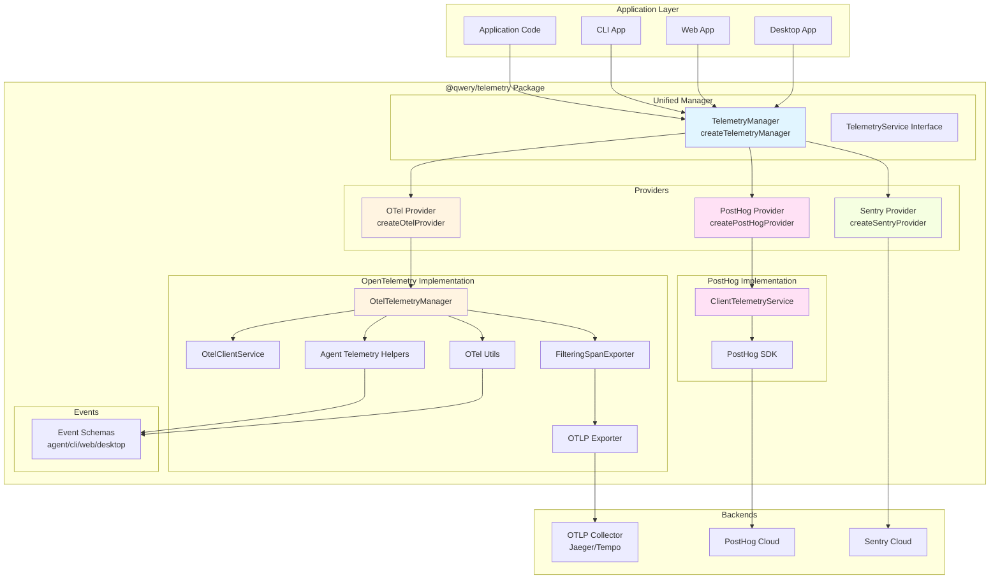
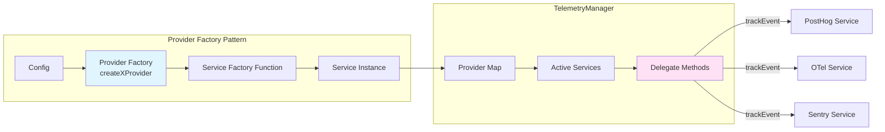
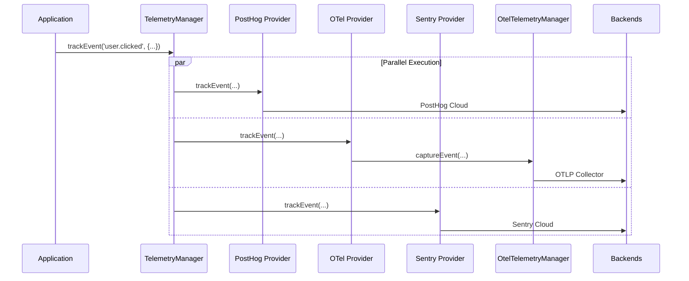
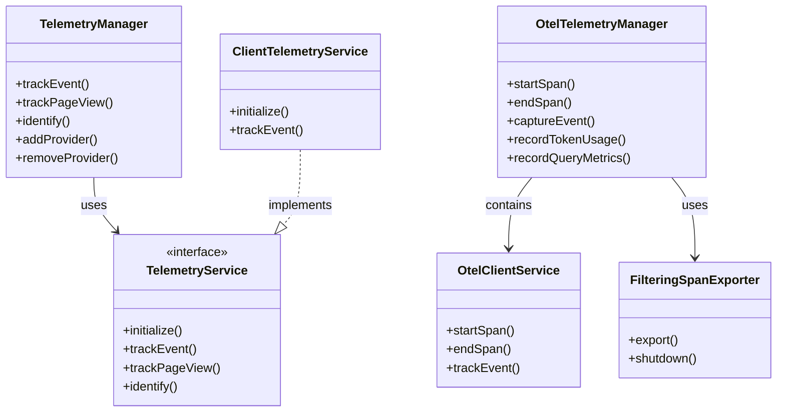
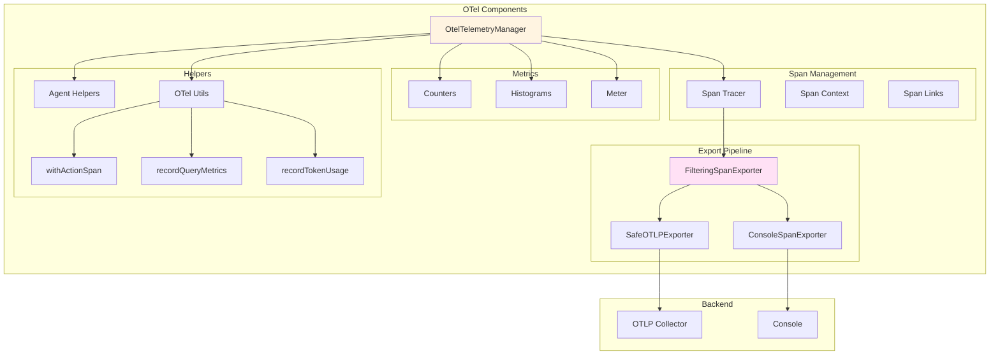
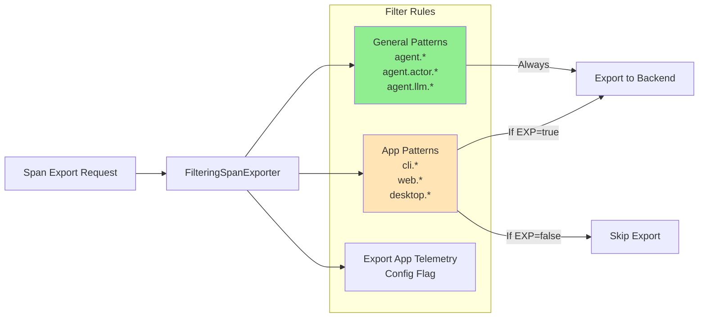
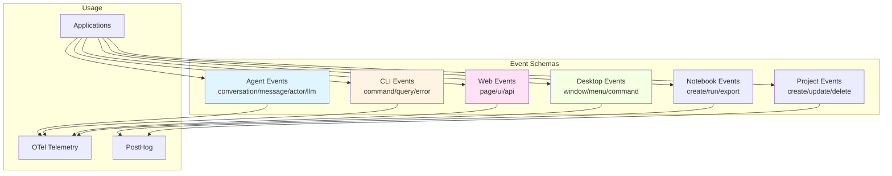
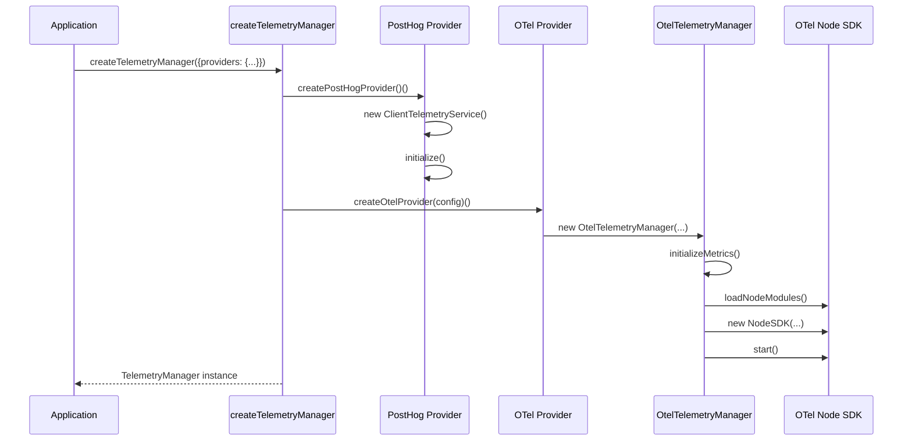

# Telemetry Package Architecture

## Overview

The `@qwery/telemetry` package provides a unified telemetry system supporting multiple backends:
- **OpenTelemetry (OTel)** - Observability (spans, metrics, traces)
- **PostHog** - Product analytics (events, user tracking)
- **Sentry** - Error tracking (errors, exceptions)

## Architecture Diagram



## Provider Pattern



## Data Flow



## Component Relationships



## OpenTelemetry Architecture



## Span Filtering Logic



## Event Schema Organization



## Initialization Flow



## Usage Examples

### Basic Setup (PostHog only)
```typescript
import { createTelemetryManager } from '@qwery/telemetry';
import { createPostHogProvider } from '@qwery/telemetry/providers';

const telemetry = createTelemetryManager({
  providers: {
    posthog: createPostHogProvider(),
  },
});
```

### Multi-Provider Setup
```typescript
import { createTelemetryManager } from '@qwery/telemetry';
import { 
  createPostHogProvider,
  createOtelProvider,
  createSentryProvider 
} from '@qwery/telemetry/providers';

const telemetry = createTelemetryManager({
  providers: {
    posthog: createPostHogProvider(),
    otel: createOtelProvider({
      serviceName: 'qwery-app',
      options: { exportAppTelemetry: true }
    }),
    sentry: createSentryProvider({
      dsn: process.env.SENTRY_DSN
    }),
  },
});
```

### Direct OTel Usage (for spans/metrics)
```typescript
import { TelemetryManager } from '@qwery/telemetry/otel';

const otel = new TelemetryManager('qwery-app');
await otel.init();

const span = otel.startSpan('operation.name', { key: 'value' });
// ... do work ...
otel.endSpan(span, true);
```

## Key Design Decisions

1. **Provider Pattern**: Allows multiple backends to coexist and receive the same events
2. **Unified Interface**: All providers implement `TelemetryService` for consistency
3. **Lazy Loading**: Node.js-only OTel modules are loaded dynamically to avoid browser bundling
4. **Span Filtering**: Selective export of app-specific telemetry while always exporting general spans
5. **Dual Tracking**: OTel for observability, PostHog for product analytics
6. **Type Safety**: Strong TypeScript types for all events and attributes

## File Structure

```
packages/telemetry/src/
├── otel/                    # OpenTelemetry implementation
│   ├── manager.ts          # OtelTelemetryManager
│   ├── utils.ts            # Generic utilities
│   ├── client-service.ts   # OTel client wrapper
│   ├── null-service.ts     # No-op service
│   ├── filtering-exporter.ts
│   ├── agent-helpers.ts    # Agent-specific helpers
│   ├── context.tsx         # React context
│   └── index.ts
├── providers/               # Provider factories
│   ├── posthog.ts
│   ├── otel.ts
│   ├── sentry.ts
│   └── index.ts
├── events/                  # Event schemas
│   ├── agent.events.ts
│   ├── cli.events.ts
│   ├── web.events.ts
│   ├── desktop.events.ts
│   ├── notebook.events.ts
│   ├── project.events.ts
│   └── index.ts
├── telemetry-manager.ts     # Unified manager
├── client.telemetry.service.ts  # PostHog service
├── types.ts                 # Type definitions
└── index.ts                 # Main exports
```

